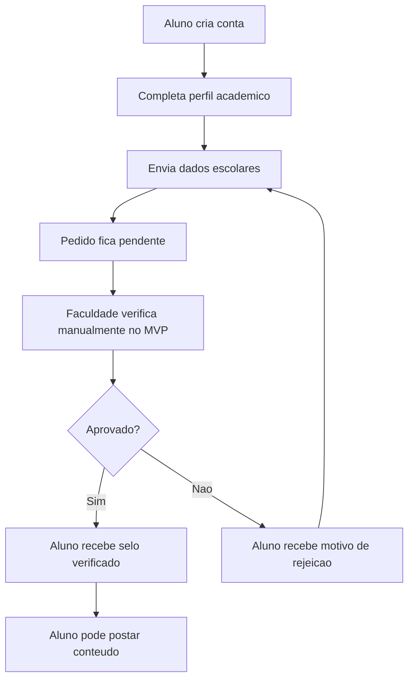
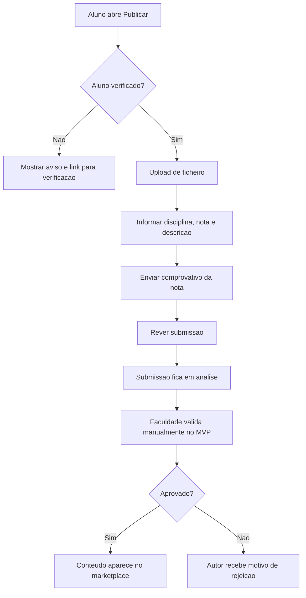
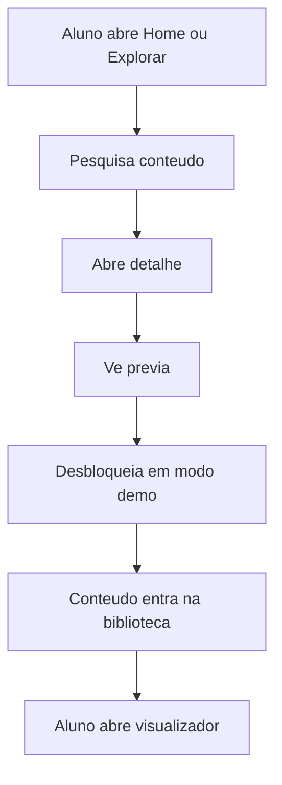

# 03 - Paginas e Fluxos

## Estrutura Do App Mobile

O app mobile sera a experiencia principal dos estudantes. Ele deve ser simples, direto e focado em tres objetivos:

- encontrar bons exemplos academicos;
- pedir verificacao para poder publicar;
- submeter conteudos com boas notas.

## Paginas Do MVP Mobile

### 1. Splash

Tela inicial enquanto o app carrega a sessao do utilizador.

### 2. Onboarding

Apresenta a ideia do NotaTop:

- exemplos academicos validados;
- alunos verificados;
- conteudos por curso e disciplina;
- publicacao apenas com validacao.

### 3. Login

Permite entrar com email e senha.

### 4. Cadastro

Cria nova conta de estudante.

### 5. Completar Perfil

Recolhe dados academicos basicos:

- nome;
- faculdade;
- curso;
- semestre;
- numero de estudante;
- email institucional.

### 6. Enviar Dados Escolares

Formulario para pedir verificacao de aluno.

Campos:

- numero de estudante;
- curso;
- documento escolar opcional;
- confirmacao de que os dados sao verdadeiros.

### 7. Estado Da Verificacao

Mostra:

- nao enviado;
- pendente;
- aprovado;
- rejeitado;
- motivo da rejeicao;
- botao para reenviar dados.

### 8. Home

Mostra:

- conteudos em destaque;
- disciplinas populares;
- conteudos recentes;
- chamada para verificacao, se o aluno ainda nao estiver verificado.

### 9. Explorar

Pesquisa e filtros.

Filtros:

- faculdade;
- curso;
- disciplina;
- tipo de conteudo;
- nota minima;
- mais recentes;
- mais vistos;
- mais bem avaliados.

### 10. Detalhe Do Conteudo

Mostra:

- titulo;
- autor;
- selo de aluno verificado;
- nota validada;
- disciplina;
- tipo;
- descricao;
- previa;
- botao de desbloqueio demo.

### 11. Previa

Mostra uma amostra limitada do conteudo.

### 12. Desbloqueio Demo

Simula o fluxo de desbloquear conteudo sem pagamento.

### 13. Biblioteca

Lista conteudos desbloqueados pelo utilizador.

### 14. Visualizador

Abre o conteudo dentro do app com marca d'agua.

### 15. Favoritos

Lista conteudos guardados.

### 16. Publicar Conteudo

Entrada do fluxo de submissao. Se o aluno nao estiver verificado, esta pagina mostra aviso e direciona para verificacao.

### 17. Upload De Ficheiro

Seleciona PDF, documento, apresentacao ou imagem.

### 18. Dados Do Conteudo

Campos:

- titulo;
- descricao;
- curso;
- disciplina;
- professor opcional;
- semestre;
- tipo de conteudo;
- nota recebida.

### 19. Comprovativo Da Nota

Envia documento ou imagem que prova a nota.

### 20. Rever Submissao

Confirma todos os dados antes de enviar.

### 21. Minhas Submissoes

Lista conteudos enviados pelo autor.

### 22. Estado Da Submissao

Mostra:

- rascunho;
- em analise;
- aprovado;
- rejeitado;
- motivo da rejeicao.

### 23. Perfil

Mostra dados do utilizador, selo verificado e atalhos.

### 24. Perfil Publico Do Autor

Mostra:

- nome publico;
- selo verificado;
- conteudos aprovados;
- reputacao;
- avaliacoes futuras.

### 25. Configuracoes

Inclui:

- dados da conta;
- privacidade;
- notificacoes;
- logout.

## Fluxo De Verificacao

## Fluxo De Publicacao

## Fluxo De Consumo De Conteudo

## Paginas Do Painel Web Futuro

O painel web sera separado do app mobile e usado apenas por faculdade e admins.

- Login administrativo.
- Dashboard.
- Verificacoes de alunos pendentes.
- Analise de dados escolares.
- Aprovar ou rejeitar aluno.
- Fila de conteudos pendentes.
- Validacao de nota e conteudo.
- Cursos e disciplinas.
- Regras de nota minima.
- Gestao de posts.
- Denuncias.
- Relatorios.
- Financeiro futuro.
- Logs de auditoria.
- Permissoes.
