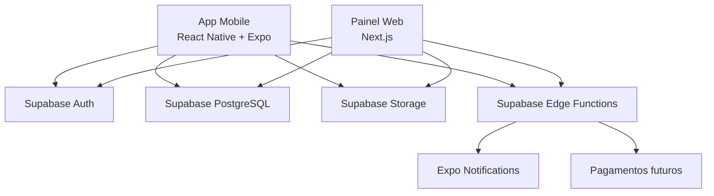

# 04 - Arquitetura Tecnica

## Decisao Principal

O app mobile e a web devem ser separados. Eles nao serao a mesma aplicacao e o app mobile nao sera uma webview.

Separacao:

- `apps/mobile`: app Android e iOS para estudantes.
- `apps/admin-web`: painel web para faculdade e administradores.
- `packages/shared`: tipos, validacoes e regras comuns.
- `supabase`: base de dados, funcoes, storage e politicas de acesso.

## Arquitetura Geral



## Stack Do App Mobile

- React Native.
- Expo.
- TypeScript.
- Expo Router.
- TanStack Query.
- React Hook Form.
- Zod.
- Supabase JS SDK.
- Expo Document Picker.
- Expo Image Picker.
- Expo Notifications.

## Stack Do Painel Web Futuro

- Next.js.
- TypeScript.
- Tailwind CSS.
- Supabase JS SDK.
- Vercel.

## Backend

- Supabase Auth para autenticacao.
- PostgreSQL para dados relacionais.
- Supabase Storage para ficheiros.
- Row Level Security para permissoes.
- Edge Functions para acoes sensiveis.

## Estrutura Recomendada

```txt
nota-top/
  apps/
    mobile/
      app/
      src/
        components/
        features/
        lib/
        services/
        styles/
        types/
    admin-web/
      app/
      src/
  packages/
    shared/
      src/
        schemas/
        types/
        constants/
  supabase/
    migrations/
    functions/
    seed.sql
  docs/
```

## Responsabilidades Por Camada

### App Mobile

- Experiencia do estudante.
- Login e cadastro.
- Perfil academico.
- Pedido de verificacao.
- Submissao de conteudos.
- Marketplace.
- Biblioteca.
- Visualizador.

### Painel Web

- Verificacao de alunos.
- Validacao de conteudos.
- Gestao de cursos e disciplinas.
- Moderacao.
- Relatorios.
- Gestao financeira futura.

### Backend Supabase

- Guardar dados.
- Proteger acesso.
- Guardar ficheiros privados.
- Aplicar regras de permissao.
- Processar acoes criticas.

## Regras De Seguranca

- Ficheiros devem ficar em buckets privados.
- O utilizador so pode ver os seus proprios pedidos de verificacao.
- Apenas alunos verificados podem criar submissoes.
- Apenas conteudos aprovados aparecem no marketplace.
- Apenas utilizadores com desbloqueio podem abrir conteudo completo.
- Acoes administrativas devem ser auditadas.
- Futuramente, validadores da faculdade terao permissoes diferentes de admins NotaTop.

## Decisoes Tecnicas

### ADR-001: Usar React Native Com Expo

**Status:** Aceite.

**Contexto:** O app precisa funcionar em Android e iOS, com desenvolvimento rapido e boa apresentacao para a faculdade.

**Decisao:** Usar React Native com Expo e TypeScript.

**Consequencias:**

- Positivo: uma base de codigo para Android e iOS.
- Positivo: build mais simples com Expo EAS.
- Positivo: bom ecossistema para notificacoes, ficheiros e navegacao.
- Negativo: algumas integracoes nativas avancadas podem exigir configuracao extra.

### ADR-002: Usar Supabase Como Backend Inicial

**Status:** Aceite.

**Contexto:** O MVP precisa de autenticacao, base de dados, storage e permissoes sem criar um backend complexo do zero.

**Decisao:** Usar Supabase com PostgreSQL, Auth, Storage e Edge Functions.

**Consequencias:**

- Positivo: reduz tempo de desenvolvimento.
- Positivo: PostgreSQL e adequado para dados relacionais.
- Positivo: Row Level Security ajuda na seguranca.
- Negativo: regras de permissao precisam ser bem escritas para evitar vazamento de dados.

### ADR-003: Separar App Mobile E Painel Web

**Status:** Aceite.

**Contexto:** Estudantes e faculdade tem necessidades diferentes.

**Decisao:** Criar app mobile para estudantes e painel web separado para gestao.

**Consequencias:**

- Positivo: cada produto fica focado no seu publico.
- Positivo: permissoes ficam mais claras.
- Positivo: facilita apresentar a faculdade como sistema profissional.
- Negativo: exige manter duas interfaces.

## Riscos Tecnicos

| Risco | Impacto | Mitigacao |
| --- | --- | --- |
| Permissoes mal configuradas | Vazamento de dados ou ficheiros | Usar RLS, testes e buckets privados |
| Upload de ficheiros grandes | App lento ou caro | Limitar tamanho e tipo de ficheiro |
| Validacao manual no MVP | Processo operacional lento | Comecar manualmente e depois criar painel web |
| Pagamentos por pais | Gateway pode nao suportar todos os pais | Deixar pagamentos fora do MVP |
| Plagio e uso indevido | Problema academico e reputacional | Termos claros, validacao e denuncia |
